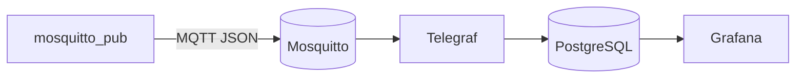
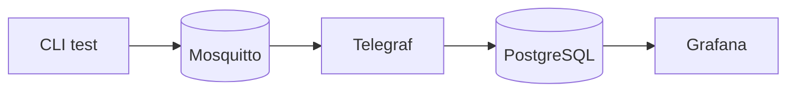

# 17683 – Dag 2 – Central serverstack
## Elevversion v0.1

Denne mappe indeholder starteren til den centrale backend i 17683.

Målet er ikke at skrive hele containerstacken fra bunden. Du skal i stedet **forstå, konfigurere, teste og forbinde de enkelte dele**.

## Dagens backend-mål



Når du er færdig, skal en kendt MQTT-testbesked kunne ende som en synlig måling i Grafana.

---

# 1. Hele projektmappen skal ligge på Debian-serveren

Kopiér eller pak **hele denne mappe** ud på din Debian-server.

Det er ikke meningen, at du manuelt kopierer konfigurationsfiler til `/etc/mosquitto`,
`/etc/telegraf` osv.

Projektet bruger filerne direkte fra denne mappe.

Strukturen bør ligne:

```text
17683_Dag2_Serverstack_elev_v0.1/
├── .env.example
├── .gitignore
├── compose.yaml
├── README.md
├── mosquitto/
│   └── mosquitto.conf
├── telegraf/
│   └── telegraf.conf
└── test/
    ├── publish-test.sh
    └── test-payload.json
```

Filer der starter med `.` er skjulte på Linux.

Terminal:

```bash
ls -la
```

KDE Dolphin:

```text
Ctrl + H
```

## Eksempel: kopiér med SCP

Fra en Linux-klient kan en hel mappe fx kopieres med:

```bash
scp -r MAPPE USER@SERVER-IP:~/

#eks:
scp -r 17683_Dag2 name@192.168.insert.10:~/
enter  password for user
```

Gå derefter ind i projektmappen på Debian-serveren.

Alle `podman compose`-kommandoer i denne vejledning forventer, at din shell står i mappen,
hvor `compose.yaml` ligger.

Kontrollér:

```bash
pwd
ls -la
```

---

# 2. Se stacken før du starter den

Åbn:

```text
compose.yaml
```

Find de fire services.

For hver service bør du kunne finde:

- hvilket **image** der bruges,
- om den har et **volume**,
- om en port publiceres på Debian-hosten,
- hvilke **environment variables** den modtager.

Du behøver ikke kunne skrive Compose-YAML fra hukommelsen.

Du skal kunne forklare, hvad de vigtigste dele gør.

Nyttige begreber:

```text
image
= det grundlag en container startes fra

container
= en kørende instans

volume
= data som skal kunne overleve containerens lifecycle

port mapping
= gør en containerport tilgængelig via hosten

environment
= konfigurationsværdier der gives til processen/containeren
```

---

# 3. Lav din lokale `.env`

Projektet indeholder:

```text
.env.example
```

Det er en skabelon.

Lav din egen lokale konfiguration:

```bash
cp .env.example .env
```

Redigér derefter `.env` og udskift eksempel-passwords.

Kontrollér:

```bash
ls -la
```

`.env` står i `.gitignore` og skal ikke committed med rigtige passwords.

---

# 4. Start stacken

Kontrollér først:

```bash
podman --version
podman compose version
```

Start derefter:

```bash
podman compose pull
podman compose up -d
podman ps
```

Du bør kunne identificere containers til:

```text
Mosquitto
PostgreSQL
Telegraf
Grafana
```

Hvis en container ikke opfører sig som forventet, brug logs:

```bash
podman logs CONTAINER-NAVN
```

eller:

```bash
podman compose logs
```

**Bemærk:** Telegraf-konfigurationen indeholder bevidste `TODO`-felter. Telegraf-delen
forventes derfor ikke at behandle data korrekt, før du har færdiggjort konfigurationen.

---

# 5. Checkpoint A – test Mosquitto uafhængigt

Før du arbejder med Telegraf, skal du bevise at broker-delen virker.

Åbn to terminaler på Debian-serveren.

I den ene bruger du:

```text
mosquitto_sub
```

til at abonnere på de relevante gateway-topics.

I den anden bruger du enten:

```text
mosquitto_pub
```

eller:

```bash
./test/publish-test.sh
```

til at sende en besked.

Målet er:

```text
publisher
→ Mosquitto
→ subscriber
```

Hvis dette ikke virker, skal du ikke fejlfinde Telegraf eller Grafana endnu.

Dokumentation:

https://mosquitto.org/man/mosquitto_pub-1.html

https://mosquitto.org/man/mosquitto_sub-1.html

https://mosquitto.org/man/mqtt-7.html

---

# 6. Datakontrakten

Backend'en skal kunne modtage processed weather-data med denne struktur:

```json
{
  "device_id": "test-01",
  "gateway_id": "bp-test",
  "timestamp": "2026-08-10T20:00:00Z",
  "temperature_c": 21.5,
  "humidity_pct": 48.0,
  "pressure_hpa": 1012.3
}
```

`test/publish-test.sh` genererer samme struktur med et aktuelt UTC-timestamp.

På Dag 2 producerer CLI-testen data.

Senere i forløbet bliver samme type payload produceret af `telemetry-processor`.

---

# 7. Checkpoint B – færdiggør Telegraf

Åbn:

```text
telegraf/telegraf.conf
```

Find `TODO`-felterne.

Du skal bruge:

- testpayloaden,
- topic-strukturen,
- `compose.yaml`,
- `.env`,
- og Telegraf-dokumentationen

til at finde de korrekte værdier.

Du skal bl.a. tage stilling til:

```text
Hvilke MQTT topics skal Telegraf abonnere på?
Hvilket JSON-felt er timestamp?
Hvilket timestamp-format bruges?
Hvilke værdier beskriver kilden og passer som tags?
Hvilke værdier er målinger og passer som fields?
Hvordan adresseres PostgreSQL fra en anden container?
```

Genstart Telegraf efter ændringer, hvis nødvendigt:

```bash
podman restart iot-telegraf
```

Følg logs:

```bash
podman logs -f iot-telegraf
```

Dokumentation:

https://docs.influxdata.com/telegraf/v1/input-plugins/mqtt_consumer/

https://docs.influxdata.com/telegraf/v1/data_formats/input/json_v2/

https://docs.influxdata.com/telegraf/v1/output-plugins/postgresql/

---

# 8. Checkpoint C – bevis at PostgreSQL modtager data

Når Telegraf ikke længere melder relevante parser/connection-fejl, send en ny testmåling.

Åbn PostgreSQL-klienten inde i containeren:

```bash
podman exec -it iot-postgres \
  psql -U iot -d iot
```

Undersøg databasen.

Nyttige `psql`/SQL-kommandoer:

```sql
\dt
```

og generelt:

```sql
SELECT *
FROM TABEL
ORDER BY time DESC
LIMIT 10;
```

Du skal selv finde den tabel, Telegraf har oprettet/bruger.

Målet er at kunne pege på den konkrete række, som kom fra MQTT-testen.

PostgreSQL dokumentation:

https://www.postgresql.org/docs/current/

---

# 9. Checkpoint D – forbind Grafana

Åbn Grafana i en browser på den port, der er publiceret i `compose.yaml`.

Login-oplysningerne findes i din lokale `.env`.

Tilføj derefter en PostgreSQL datasource.

Når Grafana og PostgreSQL begge kører som Compose-services, skal du overveje:

> Hvad betyder `localhost` inde i Grafana-containeren?

> Hvilket hostname kan en Compose-service bruge for at finde en anden service?

Brug `compose.yaml` og dokumentationen til at finde:

- host/port,
- database,
- user,
- password,
- passende SSL/TLS-indstilling for denne lokale undervisningsstack.

Dokumentation:

https://grafana.com/docs/grafana/latest/datasources/postgres/

https://grafana.com/docs/grafana/latest/datasources/postgres/configure/

---

# 10. Lav et enkelt panel

Lav et dashboard/panel der viser mindst én numerisk vejrmåling over tid.

Din SQL-query skal som minimum give Grafana:

```text
en tidskolonne
+
en numerisk måleværdi
```

Find i Grafana-dokumentationen, hvordan PostgreSQL-query editoren bruges til time series.

Start enkelt.

Når én måling virker, kan du tilføje flere.

---

# Dagens backend-checkpoint

Du er nået til dagens forventede niveau, når du kan demonstrere:



og kan forklare:

- hvad Mosquitto gør,
- hvad Telegraf gør,
- hvor data lagres,
- hvad Grafana gør,
- hvorfor containers bruger service-navne til intern kommunikation,
- hvad et volume bruges til,
- hvordan du finder det første led der fejler.

---

# Hvis du har mere tid

Når hele kæden virker:

- lav paneler til flere måleværdier,
- stop og start stacken og kontrollér persistence,
- undersøg `podman ps` og `podman logs` nærmere,
- læs `compose.yaml` igen og forklar hver service med egne ord,
- dokumentér backend-arkitekturen i dit projekts README.

Undgå at ændre arkitekturen eller tilføje tilfældige nye services, før minimumskæden er stabil.
